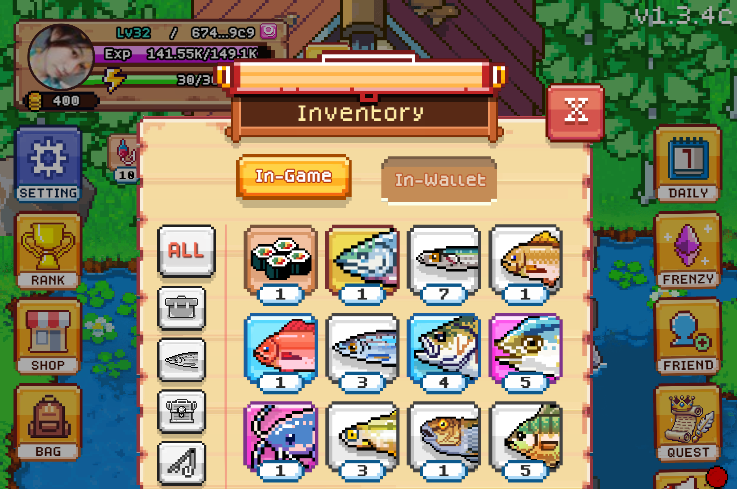

# FISHING FRENZY BOT

Building the onchain economy with @base. Fishing is just the start. 🐟 Developed by @gguncharted.

- Twitter : [Fishing Frenzy Co](https://x.com/fishingfrenzyco)

- Website : [Fishing Frenzy](https://fishingfrenzy.co)



## BOT FEATURE

- Register Accounts Using New Wallets.
- Load Existing Tokens: Load pre-existing tokens if you already have account.
- Auto Fishing.
- Auto Daily Checkin.
- Auto Complete Quest
- Auto Buy And Use EXP Scroll.
- Support Multy Accounts.
- Support Proxy.

## PREREQUISITE

- Git
- Node.js : Ensure you have Node.js installed.
- npm : Ensure you have npm installed.

## CONFIGURE BOT

- If you already have account you can put `access-token` to `tokens.txt`.

- Put your proxy in file `proxy.txt` format:
  
  ```bash
  http://username:pass@ip:port
  ```

## INSTALLATION

1. Clone this repository:
   ```bash
   git clone https://github.com/Rambeboy/fishfrenzy-bot.git && cd fishfrenzy-bot
   ```

2. Install dependencies:
   ```bash
   npm install
   ```

3. Configure the proxy:
   ```bash
   nano proxy.txt
   ```

4. Setup to create accounts and get Tokens:
   ```bash
   npm run setup
   ```

5. Run The Script:
   ```bash
   npm run start
   ```

## LICENSE

This project is licensed under the MIT License - see the [LICENSE](LICENSE) file for details.

---
